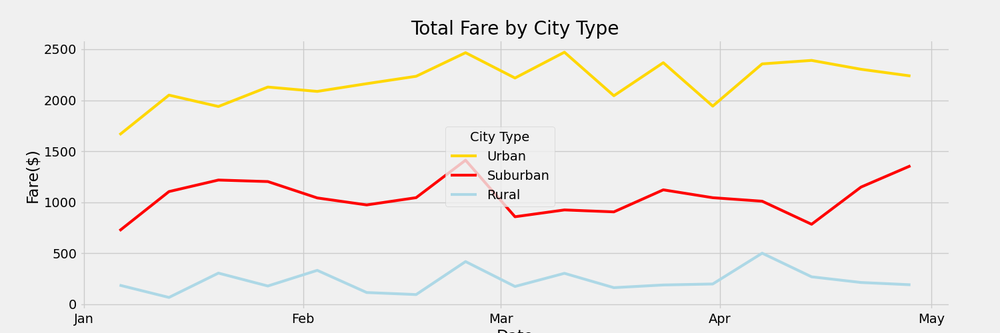

# PyBer_Analysis

## Overview 
Analyze two sets of data from a ridesharing app. The data is compiled of information on rural, suburban, and urban cities as well as prices on rides, how many rides provided, and how many drivers they have. We will focus in on data from January 1 to April 29, 2019. The goal is to provide findings that will improve access to their ridesharing services.

### Resources
- Data Sources: 
    - [Resources/city_data.csv]( Resources/city_data.csv)
    - [Resources/ride_data.csv]( Resources/ride_data.csv)
- Software: Python 3.9.6, Jupyter Notebook

## Results

### Code
- [PyBer_Challenge.ipynb]( PyBer_Challenge.ipynb)

### Summary of Findings 

In analyzing the data for PyBar we see that 

### Summary of Recommendations for PyBar

### Images

##### PyBar Line Graph - Total Fare by City –
- [Images/pyber_challenge_graph.png](Images/pyber_challenge_graph.png)

#### Code
- [PyBer_Challenge.ipynb]( PyBer_Challenge.ipynb)

