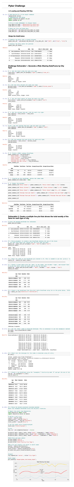

# PyBer_Analysis

## Overview 
Analyze two sets of data from a ridesharing app. The data is compiled of information on rural, suburban, and urban cities as well as prices on rides, how many rides provided, and how many drivers they have. We will focus in on data from January 1 to April 29, 2019, for our visualization. The goal is to provide findings that will improve access to PyBar’s ridesharing services.

### Resources
- Data Sources: 
    - [Resources/city_data.csv]( Resources/city_data.csv)
    - [Resources/ride_data.csv]( Resources/ride_data.csv)
- Software: Python 3.9.6, Jupyter Notebook

## Results

### Code
- [PyBer_Challenge.ipynb](PyBer_Challenge.ipynb)

### Summary of Findings 

In analyzing the whole data set provided we find that there are many useful conclusions we can draw. With data parsed out by area type we are able to see that the volume of rides in a rural city was 125, a suburban city was 625, and the urban city was the highest with 1,625 rides. We were able to find the total revenue for each area, a rural city took in $4,327.93, a suburban city $19,356.33, and the urban city revenue was highest with a $39,854.38. With that data we were then able to calculate that the average ride in a rural city was $34.62, a suburban city was $30.97, and the urban city was lowest with a $24.52 average ride. 

When we look at the driver’s data we are able to understand that in a rural city they have 78 drivers, a suburban city has 490, and the urban city was the highest number of drivers with 2,405 drivers. We are also able to calculate that the average fare per driver was $ 55.49 in a rural city, $39.50 in a suburban city, and $16.57 in urban cities. 

When we drill down into our focus, January through April, 2019 , we put together a line chart that shows the success by city type, rural, suburban, and urban. As you can see pictured below, rural is the blue line and looks to fluctuate the least. The suburban city had two nice peaks in late February and late April. The urban area analyzed is the line on the top in gold, it portrays a revenue stream that starts at its lowest point and then it finishes about 25% lower than its highest point. The urban line is up and down a lot.

In conclusion we observe that even though fare prices per ride are the lowest in an urban area, the volume of rides well make up for that disparity.    

### Summary of Recommendations for PyBar

In order to improve access to PyBar’s services we recommend focusing on urban areas. The investment here will pay off with the sheer volume of rides. Make sure that when there are local events happening that there are plenty of drivers on staff in the right geo to pick up calls. To increase revenue in rural areas helping drivers understand that building repour with locals ensures that they will reach out to PyBar when they are in need of safe transportation.  

### Images

##### PyBar Line Graph - Total Fare by City –
- [Images/pyber_challenge_graph.png](Images/pyber_challenge_graph.png)

#### Code
- [PyBer_Challenge.ipynb](PyBer_Challenge.ipynb)
- [Images/PyBar_Challenge_code.png](Images/PyBar_Challenge_code.png)

